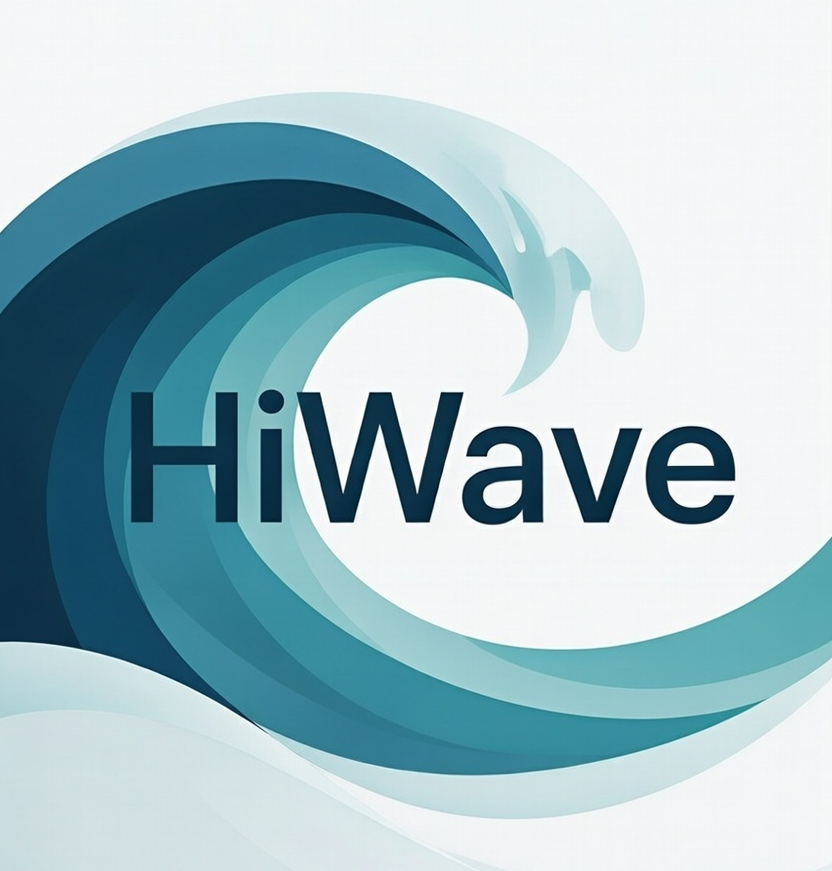

<p align="center">
  
</p>

<h1 align="center">HiWave for Linux</h1>

<p align="center">
  <strong>Focus. Flow. Freedom.</strong><br>
  A privacy-first browser built from scratch in Rust.
</p>

<p align="center">
  <a href="#features">Features</a> •
  <a href="#installation">Installation</a> •
  <a href="#building">Building</a> •
  <a href="#contributing">Contributing</a>
</p>

<p align="center">
  
  <a href="https://github.com/hiwavebrowser/hiwave-linux/actions/workflows/metrics.yml"></a>
  
  
  
</p>

---

## The Problem

Modern browsers are designed to keep you browsing. More tabs, more tracking, more data vultures, more history, more extensions, more complexity. The result? Dozens of open tabs you'll "get to eventually," fractured attention, and digital clutter that drains your focus and steals your privacy.

## The Solution

**HiWave** flips the script. We built a browser that actively helps you browse *less* — in a good way.

- **The Shelf** — Tabs you're not using decay and fade away, so you don't have to manually manage them
- **Workspaces** — Separate contexts (work, personal, research) that don't bleed into each other
- **Built-in Privacy** — Ad and tracker blocking with no extensions needed
- **Three Modes** — Choose your level of automation: do it yourself, get suggestions, or let Flow handle it

---

## Engine Status — Linux

*Measured on `master` at `4f0ba80c`, 2026-07-30. Numbers come from CI, not from
hand-editing this file — see
[How these numbers are produced](#how-these-numbers-are-produced).*

| | |
|---|---|
| Build | **passing** (`cargo build --workspace`, 0 errors) |
| Tests | **742 passing**, 0 failing, 5 ignored |
| App shell | **launches** — chrome + content WebViews create under GTK, verified live |
| Rust source | ~70,400 lines across 37 crates |
| Visual parity vs Chrome | **not measured on Linux** — see below |

### What landed recently

Late July 2026 brought the Linux tree from a non-launching shell to a running
browser with a substantially larger engine, ported from the macOS tree as
contract ports rather than line-diff copies:

- **The app shell launches.** WebView embedding was rebuilt on the GTK path
  (`build_gtk` into a shared `gtk::Fixed`); previously the app panicked with
  `UnsupportedWindowHandle` before any window existed. Text input and the
  settings window (native Wayland) were fixed with it.
- **Unicode text algorithms** — bidi (UAX #9), line breaking (UAX #14), grapheme
  and word segmentation. CRLF is honoured as a single mandatory break (LB5).
- **CSS type coverage** — transforms, box-shadow and backdrop-filter types,
  animation timing functions, background layer properties, and high-precision
  `ColorF32` with premultiplied and gamma-correct interpolation.
- **Length units** — viewport units (`vw`/`vh`/`vmin`/`vmax`) and the CSS math
  functions `min()`, `max()`, `clamp()`.
- **Layout** — CSS 2.1 §8.3.1 margin collapsing, an epoch-based intrinsic-size
  cache, and a fix for a default that sized every unstyled element 0×0.
- **Renderer groundwork** — headless compositor render targets, ordered-dither
  tables, and the CPU half of the visual-parity pipeline (PPM save +
  image-compare primitives).
- **A `rem` parsing bug** that silently dropped *every* `rem` length is fixed.

### Known gaps — stated, not hidden

- **No visual-parity number for Linux.** The parity harness needs a real GPU
  capture path; run without one it defaults each case to a confident-looking
  100% diff that measures the runner rather than the renderer. This row stays
  empty until a real capture exists.
- **Gradients** still use a Linux-local representation; unifying with the macOS
  tree is deferred until the renderer work so representation and consumers move
  together.
- Ported modules are registered and tested but **not all are wired into the
  render path yet** — a passing test count is not a claim about what you see on
  screen.
- Two crates currently compile without executing any tests (`hiwave_core`,
  `hiwave_smoke`); CI flags them on every run rather than letting them read as
  covered.

### How these numbers are produced

Every push runs [`.github/workflows/metrics.yml`](.github/workflows/metrics.yml),
which builds the workspace, runs the full test suite, attributes results per
crate, and flags any crate compiling green while executing **zero** tests. Each
run on `master` appends a row to `metrics/history.csv` on the
[`metrics-history`](https://github.com/hiwavebrowser/hiwave-linux/tree/metrics-history)
branch, so the figures above are auditable rather than asserted.

Deliberately **not** collected: the visual-parity diff, for the reason above.
The metrics JSON records that omission explicitly instead of defaulting it to a
number.

---

## Features

### 🗂️ The Shelf
Park tabs for later without leaving them open. Shelved items show their age, naturally fading so forgotten pages don't haunt you forever.

### ⏰ Tab Decay
Unused tabs gradually fade, giving you visual cues about what's actually important. In Flow mode, old tabs automatically shelve themselves.

### 🛡️ Flow Shield
Native ad and tracker blocking powered by Brave's engine. No extension required. Just fast, private browsing out of the box.

### 🔐 Flow Vault
Built-in password manager with AES-256 encryption. Your credentials stay local and secure.

### 🗃️ Workspaces
Separate your browsing contexts completely. Work tabs stay in Work, personal stays in Personal. Switch instantly with keyboard shortcuts.

### ⌨️ Keyboard First
Power users rejoice. Everything is accessible via keyboard:
- `Ctrl+K` — Command palette (search anything)
- `Ctrl+Shift+S` — Shelve current tab
- `Ctrl+B` — Toggle sidebar
- `Ctrl+1-9` — Jump to specific tab

### 🎛️ Three Modes
| Mode | For | What It Does |
|------|-----|--------------|
| **Essentials** | Control freaks | Manual everything |
| **Balanced** | Most people | Smart suggestions |
| **Flow** | Trust the system | Full automation |

---

## Installation

### Prerequisites

HiWave requires the following dependencies on Linux:

**Debian/Ubuntu:**
```bash
sudo apt-get install -y \
    build-essential \
    pkg-config \
    libgtk-3-dev \
    libwebkit2gtk-4.1-dev \
    libssl-dev \
    libsoup-3.0-dev \
    libjavascriptcoregtk-4.1-dev
```

**Fedora:**
```bash
sudo dnf install -y \
    gtk3-devel \
    webkit2gtk4.1-devel \
    openssl-devel \
    libsoup3-devel
```

**Arch Linux:**
```bash
sudo pacman -S gtk3 webkit2gtk-4.1 openssl libsoup3
```

### Build from Source

```bash
# Prerequisites: Rust 1.75+

git clone https://github.com/hiwavebrowser/hiwave-linux.git
cd hiwave-linux

# Build
./scripts/build.sh

# Run
./scripts/run.sh
```

Or manually with cargo:

```bash
# Build
cargo build --release -p hiwave-app

# Run
cargo run --release -p hiwave-app
```

---

## Building

### Run Modes

HiWave supports multiple rendering modes on Linux:

| Mode | Command | Description |
|------|---------|-------------|
| **GTK WebKit** (default) | `cargo run --release` | Uses GTK WebKit2 for rendering |
| **RustKit Hybrid** (experimental) | `--features rustkit` | RustKit for content, GTK WebKit for chrome |
| **Native Linux** (WIP) | `--features native-linux` | 100% RustKit with X11/Wayland |

#### GTK WebKit Mode (Default) ⭐

```bash
# Using convenience script
./scripts/run.sh

# Or directly with cargo
cargo run --release -p hiwave-app
```

This mode uses GTK WebKit2 for all rendering:
- ✅ Maximum web compatibility
- ✅ Native GTK integration
- ✅ Full WebKit rendering support

#### Debug Mode

```bash
./scripts/run-debug.sh

# Or with cargo
RUST_LOG=debug cargo run -p hiwave-app
```

---

## Philosophy

### Attention over Tabs
We don't measure success by how many tabs you open. We measure it by how focused you stay.

### Simplicity over Extensibility
No extension ecosystem. Features are built-in, tested, and integrated. One browser, one experience.

### Privacy by Default
Tracking protection isn't an add-on, it's foundational. We don't collect your data. Period.

### Modern Web Only
We target post-2020 web standards. No legacy cruft, no compatibility hacks for sites that should've been updated years ago.

---

## Architecture

```
hiwave-linux/
├── crates/
│   ├── hiwave-app/          # Main application (GTK window + WebKit)
│   ├── hiwave-core/         # Core types and utilities
│   ├── hiwave-shell/        # Tab/workspace management
│   ├── hiwave-shield/       # Ad/tracker blocking
│   ├── hiwave-vault/        # Password manager
│   └── rustkit-*/           # RustKit browser engine components
├── scripts/
│   ├── build.sh             # Build script
│   ├── run.sh               # Run release build
│   └── run-debug.sh         # Run debug build
└── Cargo.toml               # Workspace configuration
```

---

## Contributing

We welcome contributions! Please see [CONTRIBUTING.md](CONTRIBUTING.md) for guidelines.

### Development

```bash
# Run tests
cargo test --workspace

# Run with debug logging
RUST_LOG=debug cargo run -p hiwave-app

# Format code
cargo fmt --all

# Run clippy
cargo clippy --workspace
```

---

## License

HiWave is licensed under the [Mozilla Public License 2.0](LICENSE).

---

## Support

- **Issues:** [GitHub Issues](https://github.com/hiwavebrowser/hiwave-linux/issues)
- **Discussions:** [GitHub Discussions](https://github.com/hiwavebrowser/hiwave-linux/discussions)

---

<p align="center">
  <em>Built with 🦀 Rust and ❤️</em>
</p>
